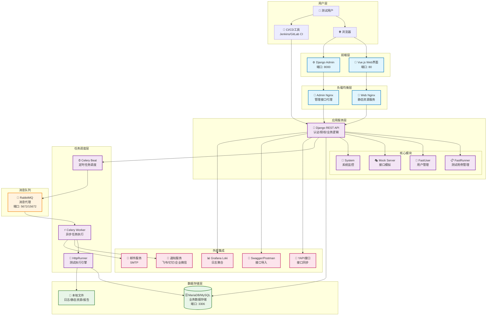

[](https://github.com/HttpRunner/FasterRunner/blob/master/LICENSE)
# FasterRunner

🚀 让接口测试更简单，让自动化更快速！

- [X] 🚀 **落地实战** - 已在 5+ 个公司中落地实战，效果显著
- [X] 🔄 **无缝同步** - 支持一键同步 YAPI（Swagger，Postman）接口数据，告别手动录入的繁琐
- [X] 💪 **强大引擎** - 基于Pythone3 + Requests 打造，轻松应对各类 HTTP(S) 测试场景，稳定可靠
- [X] 🔐 **灵活扩展** - 通过 debugtalk.py 自定义函数，轻松实现接口签名、加解密等自定义功能
- [X] 🎯 **完美联动** - 强大的 hook 机制，优雅处理接口间的token依赖和参数传递，打通测试全流程
- [X] ⏰ **智能调度** - 内置 crontab 定时任务，无学习成本，帮你实现自动化监控
- [X] 📊 **数据驱动** - 支持测试用例参数化，释放测试人员生产力
- [X] 🔄 **持续集成** - 完美对接 Gitlab-CI、Jenkins 等CI工具，助力研发效能提升
- [X] 📈 **清晰报告** - 简洁美观的测试报告，包含详尽的统计信息和日志记录，一目了然
- [X] 📱 **即时通知** - 自动推送测试报告至飞书、钉钉、企业微信，随时掌握测试动态


# 📐 系统架构



## 🏗️ 架构说明

### 分层架构设计

- **用户层**: 支持Web界面操作和CI/CD集成
- **前端层**: Vue.js单页应用 + Django Admin管理界面
- **负载均衡层**: Nginx反向代理，处理静态资源和API请求
- **应用服务层**: Django REST框架，模块化设计
- **任务调度层**: Celery分布式任务队列，支持定时和异步任务
- **数据存储层**: MariaDB关系数据库 + 本地文件存储（日志、报告、静态资源）

### 核心特性

- **微服务化设计**: 模块间松耦合，便于扩展维护
- **异步任务处理**: 大型测试任务异步执行，避免阻塞
- **定时调度**: 支持cron表达式的定时任务
- **容器化部署**: Docker Compose一键部署
- **横向扩展**: 支持多Worker节点扩展

# ⚠️ 注意
> python版本需要>=3.9 
> 
> 3.9, 3.10和3.11都经过测试
 
# 📚 文档
- 使用文档 https://www.yuque.com/lihuacai/fasterunner

# 🚀 Quick Start

## 拉取代码和启动服务
```shell
# 拉取代码
git clone git@github.com:lihuacai168/AnotherFasterRunner.git AnotherFasterRunner

# 如果你的机器连接不上Github，可以用国内的Gitee
# git clone git@gitee.com:lihuacai/AnotherFasterRunner.git AnotherFasterRunner

# 使用makefile命令快速启动所有服务，没错，一个命令就搞定
cd AnotherFasterRunner && make

# 或者使用docker-compose原始的命令, 指定配置文件启动
cd AnotherFasterRunner && docker-compose -f docker-compose-for-fastup.yml --env-file .env.example up -d
```

## 访问服务
```shell
# 默认是80端口，如果80端口被占用，修改env文件中的WEB_PORT即可
浏览器打开:
http://你的ip/fastrunner/login

用户:test
密码:test2020
```

# 💻 Dev
- [Django原生部署](https://www.jianshu.com/p/e26ccc21ddf2)

# 🔧 uWSGI
- [uWSGI+Nginx+Supervisor+Python虚拟环境部署](https://www.jianshu.com/p/577a966b0998)

# ⭐ Star History


# 👥 贡献者
<a href="https://github.com/lihuacai168/AnotherFasterRunner/graphs/contributors">
  
</a>

# 🙏 鸣谢

感谢 JetBrains 对开源项目的支持

<a href="https://jb.gg/OpenSourceSupport">
  
</a>
